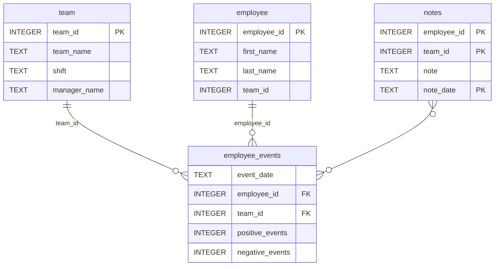

# Software Engineering for Data Scientists 

This repository contains starter code for the **Software Engineering for Data Scientists** final project. Please reference your course materials for documentation on this repository's structure and important files. Happy coding!

### Repository Structure
```
├── README.md
├── assets
│   ├── model.pkl
│   └── report.css
├── env
├── python-package
│   ├── employee_events
│   │   ├── __init__.py
│   │   ├── employee.py
│   │   ├── employee_events.db
│   │   ├── query_base.py
│   │   ├── sql_execution.py
│   │   └── team.py
│   ├── requirements.txt
│   ├── setup.py
├── report
│   ├── base_components
│   │   ├── __init__.py
│   │   ├── base_component.py
│   │   ├── data_table.py
│   │   ├── dropdown.py
│   │   ├── matplotlib_viz.py
│   │   └── radio.py
│   ├── combined_components
│   │   ├── __init__.py
│   │   ├── combined_component.py
│   │   └── form_group.py
│   ├── dashboard.py
│   └── utils.py
├── requirements.txt
├── start
├── tests
    └── test_employee_events.py
```

### employee_events.db



How to review the dashboard (quick)
Install from provided source distribution: python -m venv venv_review .\venv_review\Scripts\Activate.ps1 pip install --upgrade pip pip install dist/employee_events_pkg-0.1.0.tar.gz

Quick sanity check: python -c "from employee_events.employee import Employee; print('len:', len(Employee().names()))"

Expect: 25
Start the dashboard: pip install uvicorn python-fasthtml uvicorn report.dashboard:app Open http://127.0.0.1:8000/

Notes:

The package bundles employee_events.db and report/assets/model.pkl.
If you get "Model or data not available", ensure the environment variable EMP_EVENTS_DB is not overriding the path.
